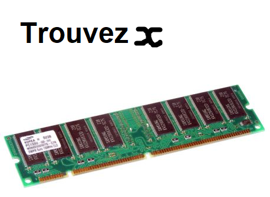
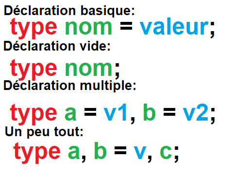

# 1 - BASES  

## Introduction

On va voir quelques bases et connaissances nécéssaires avant de faire un simple "Hello, World !" !  
Soyez sur d'être prêt et d'avoir tout ce qu'il faut dans préparation car on va un peu compiler aujourd'hui !  

## Commentaires

### C'est quoi un "homme-enterre" ?

C'est une ligne de code inutile...  
C'est pas utile en soit mais ça sert à expliquer son code aux autres !  
(Et ça sert aussi à enlever une partie de votre code "à problèmes" temporairement :P)  

### Commenfaire ?

C'est extrêmement simple !  

```c
//Coucou je suis un commentaire sur une ligne !

//Vous voulez un café ?

/* Je
suis
un
commentaire
qui
s'étend
sur plusieurs lignes :)

Youpi !*/
```  

Pour une seule ligne commentée c'est deux slashs au début de celle-ci  
Pour un paragraphe de commentaire c'est slash suivi d'un astérique au début et l'inverse à la fin  

## Variables

### C'est quoi des Avariables ?

Une variable en C c'est comme une variable mathématique.  
Sauf que le C est virtuel, donc les variables habitent dans le grand pays qu'est vos barettes de RAM...  
  
Donc votre barette de RAM va laisser un petit logement pour votre variable !  
Une variable au fond, c'est un nombre, vu que les seules variables en C sont:  
-Un nombre entier  
-Un nombre à virgule  
-Un nombre à virgule très long  
-Un caractère (Qui correspond à un nombre dans la table ASCII/UTF-8/etc)  
-Rien du tout  
  
Et si cette variable n'est pas une constante (On verra ce que c'est plus tard), on peut la modifier !  

### Les variables en C

Techniquement on à seulement:  
int (Pour *integer* -> (nombre) entier en français): Nombre entier  
float (Nombre à virgule *flottante*): Nombre à virgule  
double (*Double* de précision qu'un float): Nombre qui peut avoir le *double* de nombre après la virgule que float  
char (*character*->caractère en français): Nombre qui correspond à un caractère dans la table utilisée (ASCII par exemple)  
void (void->vide en français): Rien. Rien du tout.  
*N'est pas sensé exister* \_Bool (*Booléen*): Signifie vrai ou faux pour les conditions, très récent, préferer 1 et 0 à vrai et faux est mieux.
  
MAIS ! On peut aussi dire à ces variables: Soit juste positif, soit grand, soit petit...  
Voilà quelques "adjectifs de variables":  
-short: Petit, 16-bits, 65535 combinaisons  
-long: Grand, 32-bits ou 64-bits en fonction des systèmes et PC, 4294967296 combinaisons ou 18446744073709551615 combinaisons, ça dépend  
-long long: Très Grand, 64-bits, 18446744073709551615 combinaisons  
-signed: On coupe le nombre de possibilités en deux, la première moitié c'est les nombres négatifs jusqu'à (-1) inclus, l'autre de 0 à *max*  
-unsigned: Seulement des nombres positifs (Unsigned -> Sans signe -> Sans symbole -> Pas de "-")  
  
Trucs à savoir:  
-Un char à seulement 256 combinaisons, de -128 à 127 ou de 0 à 255, en fonction de si il est signé ou non. C'est le plus petit !  
-On peut taper juste "short"/"long"/"long long" sans rajouter int après.  
-Ce qu'on appelle "double" est en vérité "double float"  
-Il existe un type qui à le double de précision d'un double ou le quadruple d'un float: "long double"/"long double float"  
-J'ai parlé du type \_Bool récémment ajouté, ne l'utilisez pas: 0 c'est false/faux, le reste est true/vrai (1, 2, 6, 42, 349, (-12), 99...)  
-Tout est un nombre au fond. (Sauf les "structures" (Type qu'on va créer) mais c'est pour plus tard.)  
  
### Définir une variable

La syntaxe de déclaration de variables en C c'est:  
  
Par exemple:  
```c
int pommes = 3; //Miam !
char voyelle1 = 'A'; //AEIOU... I
char voyelle1m = 'a'; //aeiou... grec
long long int unMilliard = 1000000000; //Milles millions de milles sabords !
long double float presquePI = 3.1415926535897932384626433832795028841971693993751058209749445923078164062; //Et Pi' on arrivera jamais au bout de toutes façons...
double float presqueUnTiers = 1.3333333333333333333; //Beau cheval !
float troisDemis = 1.5; //Un peu de "pain-demi" ?
int quatreVingtDix = 90; //Nonante ?
```

coming soune
