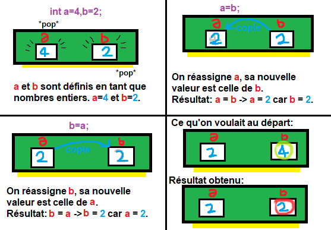
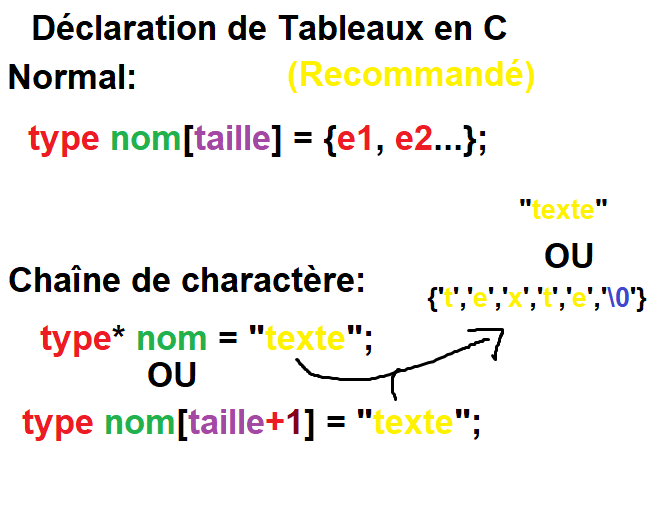
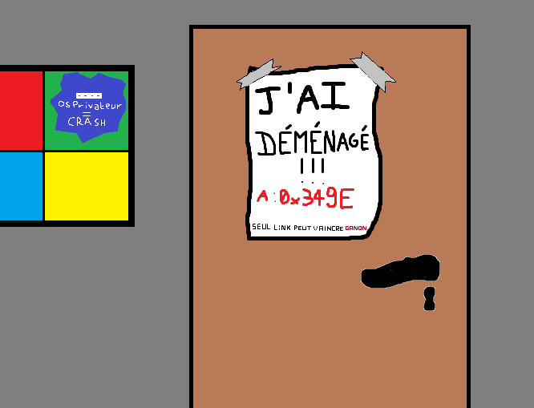
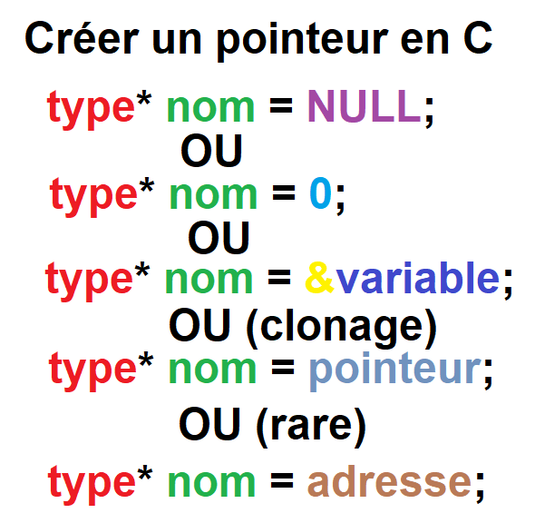
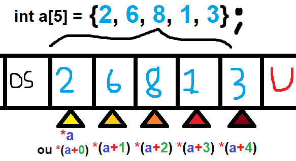
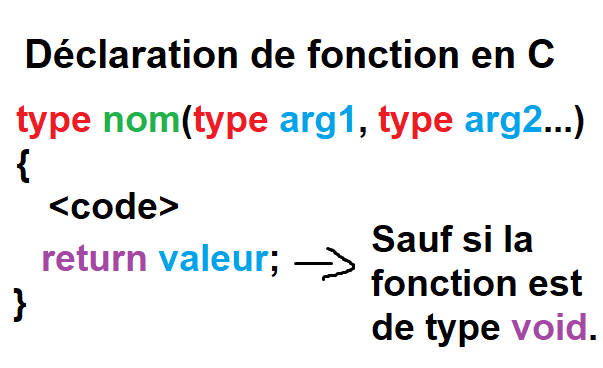

# 1 - BASES  

## Introduction

On va voir quelques bases et connaissances nécéssaires avant de faire un simple "Hello, World !" !  
Soyez sur d'être prêt et d'avoir tout ce qu'il faut dans préparation car on va un peu compiler aujourd'hui !\*  
*\* A partir du chapitre des fonctions*  

## Commentaires

### C'est quoi un "homme-enterre" ?

C'est une ligne de code inutile...  
C'est pas utile en soit mais ça sert à expliquer son code aux autres !  
(Et ça sert aussi à enlever une partie de votre code "à problèmes" temporairement :P)  

### Commenfaire ?

C'est extrêmement simple !  

```c
//Coucou je suis un commentaire sur une ligne !

//Vous voulez un café ?

/* Je
suis
un
commentaire
qui
s'étend
sur plusieurs lignes :)

Youpi !*/
```  

Pour une seule ligne commentée c'est deux slashs au début de celle-ci  
Pour un paragraphe de commentaire c'est slash suivi d'un astérique au début et l'inverse à la fin  

## Variables

### C'est quoi des Avariables ?

Une variable en C c'est comme une variable mathématique.  
Sauf que le C est virtuel, donc les variables habitent dans le grand pays qu'est vos barettes de RAM...  
  
Donc votre barette de RAM va laisser un petit logement pour votre variable !  
Une variable au fond, c'est un nombre, vu que les seules variables en C sont:  
-Un nombre entier  
-Un nombre à virgule  
-Un nombre à virgule très long  
-Un caractère (Qui correspond à un nombre dans la table ASCII)  
-Rien du tout  
  
Et si cette variable n'est pas une constante (On verra ce que c'est plus tard), on peut la modifier !  

### Les variables en C

Techniquement on à seulement:  
int (Pour *integer* -> (nombre) entier en français): Nombre entier  
float (Nombre à virgule *flottante*): Nombre à virgule  
double (*Double* de précision qu'un float): Nombre qui peut avoir le *double* de nombre après la virgule que float  
char (*character*->caractère en français): Nombre qui correspond à un caractère dans la table utilisée (ASCII normalement)  
void (void->vide en français): Rien. Rien du tout.  
*N'est pas sensé exister* \_Bool (*Booléen*): Signifie vrai ou faux pour les conditions, très récent, préferer 1 et 0 à vrai et faux est mieux.
  
MAIS ! On peut aussi dire à ces variables: Soit juste positif, soit grand, soit petit...  
Voilà quelques "adjectifs de variables":  
-short: Petit, 16-bits, 65535 combinaisons  
-long: Grand, 32-bits ou 64-bits en fonction des systèmes et PC, 4294967296 combinaisons ou 18446744073709551615 combinaisons, ça dépend  
-long long: Très Grand, 64-bits, 18446744073709551615 combinaisons  
-signed: On coupe le nombre de possibilités en deux, la première moitié c'est les nombres négatifs jusqu'à (-1) inclus, l'autre de 0 à *max*  
-unsigned: Seulement des nombres positifs (Unsigned -> Sans signe -> Sans symbole -> Pas de "-")  
-volatile: Empêcher le compilateur de "l'optimiser" (Vous ne l'utiliserez sans doute jamais)  
-const: La variable ne pourra plus jamais être modifié, c'est une constante, on dit qu'elle est "Seulement accessible en lecture"  

De plus, grâce au "structures", on aura des nouveaux types de variables, mais c'est pour plus tard !  
  
Trucs à savoir:  
-Un char à seulement 256 combinaisons, de -128 à 127 ou de 0 à 255, en fonction de si il est signé ou non. C'est le plus petit !  
-On peut taper juste "short"/"long"/"long long" sans rajouter int après.  
-Ce qu'on appelle "double" est en vérité "double float"  
-Il existe un type qui à le double de précision d'un double ou le quadruple d'un float: "long double"/"long double float"  
-J'ai parlé du type \_Bool récémment ajouté, ne l'utilisez pas: 0 c'est false/faux, le reste est true/vrai (1, 2, 6, 42, 349, (-12), 99...)  
-Tout est un nombre au fond. (Sauf les "structures" (Type qu'on va créer) mais c'est pour plus tard.)  
  
### Définir une variable

La syntaxe de déclaration de variables en C c'est:  
  
Par exemple:  
```c
int pommes = 3; //Miam !
char voyelle1 = 'A'; //AEIOU... I
char voyelle1m = 'a'; //aeiou... grec
long long int unMilliard = 1000000000; //Milles millions de milles sabords !
long double float presquePI = 3.1415926535897932384626433832795028841971693993751058209749445923078164062; //Et Pi' on arrivera jamais au bout de toutes façons...
double float presqueUnTiers = 0.3333333333333333333; //Beau cheval !
float troisDemis = 1.5; //Un peu de "pain-demi" ?
int quatreVingtDix = 90; //Nonante ?
```

Et voilà ! Vous savez désormais définir une variable en C, dernière petite chose...  

### Réassigner une variable

Vous savez très bien que vous pouvez déclarer des variables sans valeur...  
Ça serait idiot qu'elles restent sans valeur toutes leur vie ? Les pauvres !  
Pour réassigner une variable, on fait comme si on la déclarait mais sans mettre le type:  
```c
int a = 349, b; //a vaut 349, b n'a pas de valeur

b = 42; //b vaut désormais 12
a = 69; //a vaut désormais 69
b = a; //b vaut désormais pareil que a, donc 69
```

Voilà, vous savez désormais tout sur les variables !  

### Échanger des variables

#### L'erreur commune

La première idée qui peut venir c'est faire ceci:  
```c
int a = 4, b = 2; //a vaut 4 et b vaut 2
//Objectif: échanger les valeurs pour que a=2 et b=4
a = b; //a vaut b, donc a=b=2...
b = a; //b vaut a, donc b=a=2...
//a = 2 et b = 2, voilà le problème...
```

Mais c'est une erreur, voilà comment l'expliquer graphiquement:  
  
Donc comment faire ?  

#### La manière commune

Voilà ce que la plupart des gens feront: Une troisième variable.  
```c
int a = 4, b = 2; //a vaut 4 et b vaut 2
int c; //c est indéfini
//Objectif: échanger les valeurs pour que a=2 et b=4
c = a; //La variable c vaut la valeur de a, c=a=4
a = b; //La valeur de a est désormais celle de b, a=b=2
b = c; //La valeur de b est désormais celle de c, donc l'ancienne valeur de a, donc 4
//Résultat: a = 2 et b = 4 comme voulu !
//Aussi: c vaut 4
//Problème: On a utilisé une troisième variable, c'est un rien de performance en moins, mais bon...
```

#### Bonus: La manière intelligente

Je vous conseille de revenir ici après avoir vu les opérations arithmétiques sur ce README (Quand je les aurai écrite)  
  
Bref, si vous réfléchissez ou que vous êtes un peu matheux, vous avez peut-être pensé à ça:  
```c
int a = 4, b = 2; //a vaut 4 et b vaut 2
//Objectif: échanger les valeurs pour que a=2 et b=4
a = a + b; //a vaut la somme de a(4) et b(2), ici 4+2 donc 6
b = a - b; //b vaut désormais la différence de a(6) et b(2), 6-2 donc 4
a = a - b; //a vaut désormais la différence de a(6) et b(4), 6-4 donc 2
//Résultat: a = 2, b = 4, et on a pas utilisé de troisième variable !
```

Alors quelqu'un va surement dire: "Oui mais ça marche que pour les nombres entiers non ?"  
Et la réponse est oui...  
...Sauf que comme dit précédemment, tout est un nombre en C !  
  
12 -> 12  
1,34 -> 134 x 10^(-2)  
A -> 65 (ASCII)  

### Pointeurs et Tableaux

C'est le moment que tout le monde déteste: Les pointeurs  
Mais on va commencer par les Tableaux car c'est plus simple et nécéssaire !  

#### Tableaux

##### Tableaux Normaux

###### Créer un Tableau

Un tableau, c'est une liste d'éléments.  
A savoir: En angalais on dit "array" et pas tableau ou liste, ça vous sera utile en cherchant sur google.  
Bref, dans un tableau c'est plus ou moins:  
  
-Quel taille ? (Définitif)  
-Quel type d'éléments ? (Un tableau est homogène)  
-Souhaitez vous mettre quelques trucs à l'intérieur ou le laisser vide pour l'instant ?  
  
Déclaration d'un tableau:  
  

"C'est quoi ce charabia ?"  
Pour rester simple, on va utiliser le "Normal" pour l'instant, on verra le reste après.  
On va faire un tableau de nombres pour commencer:  
```c
int ages[10] = {18, 63, 23, 34, 31, 349, 72, 2, (-1), 0};
```

###### Accèder aux éléments d'un Tableau

"Ok c'est bien beau, on a des ages, mais on aimerait bien faire des trucs avec !"  
Que la lumière soit !  
  
MAIS !  
Alors il va falloir réfléchir selon cette logique:  
*"Le premier élément du tableau ages, c'est l'élément Nº0."*  
"MER C PA LOGIK !!!", beh fallait apprendre le lua et non le C, il faut des petits sacrifices pour le code.  
Donc on peut faire ça:  
```c
int ages[10] = {18, 63, 23, 34, 31, 349, 72, 2, (-1), 0};
int majorité = ages[0]; //On prends le 0ème élément de ages, donc 18
```

On peut aussi modifier des éléments:  
```c
int ages[10] = {18, 63, 23, 34, 31, 349, 72, 2, (-1), 0};
ages[0] = 6; Maintenant, ages = {6, 63, 23, 34, 31, 349, 72, 2, (-1), 0};
```

###### Connaître la taille d'un Tableau

La fonction sizeof(array) permet de savoir la taille d'un tableau:  
```c
int ages[10] = {18, 63, 23, 34, 31, 349, 72, 2, (-1), 0};
int taille_ages = sizeof(ages); //taille_ages vaut 10
```

###### Les chaînes de caractères

Je pense que certains qui ont vu les types de variables au début se sont dit:  
"MISÉRICORDE ! IL N'Y A PAS DE *STRINGS* COMMENT VA-T-ON METTRE DU TEXTE DANS DES VARIABLES ?"  
*\*String: "Chaîne de caractère" en anglais*  
La réponse à ça: Les chaînes de caractères !  
C'est simple: On fait un tableau de *char* !
*A savoir: En C les gens appellent ça des **char\*** *  

Donc voilà comment faire:
```c
char prenom[4] = {'T', 'o', 'm', '\0'}; //Compliqué mais précis
char prenom2[4] = "Eva"; //Manière normale
char* nom = {'D', 'u', 'b', 'o', 'i', 's', '\0'}; //Manière facile et précis
char* nom2 = "Dupierre"; //Manière facile
```

Dans le prochain chapitre on verra comment mettre du texte à l'écran et manipuler des strings  

##### Tableaux Multi-Dimensionnels

###### Créer un Tableau Multi-Dimensionnel

Un tableau, c'est bien, un tableau de tableaux c'est mieux !  
Voilà comment faire des tableaux 2D, 3D et 4D:  
```c
int tableau2D[2][3]; //Tableau 2D de 2x3
int tableau3D[2][3][4]; //Tableau 3D de 2x3x4
int anaKata[2][3][4][2]; //Tableau 4D de 2x3x4x2
```

###### Accèder aux éléments d'un Tableau Multi-Dimensionnel

```c
int tableau2D[2][3] = {{0}}; //Tableau 2D de 2x3 REMPLI DE ZÉROS
int tableau3D[2][3][4] = {{4}}; //Tableau 3D de 2x3x4 REMPLI DE QUATRES
int anaKata[2][3][4][2]; //Tableau 4D de 2x3x4x2

//Écrire
tableau2D[0][0] = 12;
tableau3D[0][2][1] = 3;
anaKata[1][1][2][1] = 1;

//Lire
int a = tableau2D[0][3]; //a = 0
int b = tableau3D[0][2][1]; //b = 3
int c = tableau3D[1][2][3]; //c = 4
int d = anaKata[1][1][2][1]; //d = 1
```

Les tableaux 2D et 3D peuvent servir pour un jeu en terminal par exemple !  
Par-contre 4D et plus, je vois pas trop l'interêt à moins de faire des trucs scientifiques ésothériques :O  

#### Pointeurs

##### Mettons les pointeurs sur les i

Accrochez vous ça sera pas de tout repos.  
Il y a un grand pays qui est "Les barrettes-unies de RAMérique" situé dans le continent de votre PC :)  
Dans chaque état (Barette) il y a des villes (Go de RAM ?) avec pleins de maisons :D  
Dans ces maisons il existe des variables qui y habitent paisiblement...  
...Mais certaines maisons contiennent juste une fiche sur la porte où il est écrit:  
  
Pour faire simple: Un pointeur contient l'adresse mémoire d'une autre variable !  
D'où son nom: Pointeur, car il *pointe* vers une variable !  

##### Créer un pointeur

Voilà la syntaxe de création de pointeur:  
  
Pour faire simple:  
  
-`type* nom = NULL;` et `type* nom = 0;` c'est un pointeur vide
-`type* nom = &variable;` c'est un pointeur qui pointe vers *variable*/contient l'adresse mémoire de *variable*  
-`type* nom = pointeurQuiPointe;` c'est un clone du pointeur *pointeurQuiPointe*  
-`type* nom = 0x3491;` (Remplacez 0x3491 par une adresse mémoire) c'est un pointeur qui pointe vers 0x391 dans ce cas là  
  
##### Déréférencer un pointeur

Pour accèder au contenu d'un pointeur, on le "déréférence"  
En français: On va sonner chez la maison à l'adresse qu'il y avait que contenait le papier sur la porte  
On fait comme ça:  
```c
int* ptr = 0; //Pointeur qui pointe vers rien
int age = 21; //Nombre entier choisi au hasard

ptr = &age; //On réassigne ptr, sa valeur est désormais l'adresse de age

int age_2 = 0; //On crée le nombre entier age_2, sa valeur est 0
age_2 = *ptr; //On réassigne age_2, sa valeur est ptr déréférencé, soit age, donc 21
```

Une chose importante à comprendre:  
Un pointeur contient l'adresse d'une variable, donc si la variable change...  
...Le pointeur ne change pas, par-contre, le pointeur déréférencé, lui, à changé de valeur.  
/!\\ UN POINTEUR N'EST PAS UN CLONE /!\\  

##### Des pointeurs de pointeurs

Oui, on peut faire des pointeurs qui pointent vers des pointeurs qui pointent vers...  
Pour se faire on fait comme ça:
```c
int age = 45; //Nombre entier choisi au hasard

int* p1 = &age; //p1 pointe vers age
int** p2 = &p1; //p2 pointe vers p1
int*** p3 = &p2; //p3 pointe vers p2
int**** p4 = &p3; //p4 pointe vers p3
int***** p5 = &p4; //p5 pointe vers p4
int****** p6 = &p5; //p6 pointe vers p5
int******* p7 = &p6; //p7 pointe vers p6
int******** p8 = &p7; //p8 pointe vers p7
//p8 pointe vers p7 qui pointe vers p6 ... qui pointe vers p2 qui pointe vers p1

int age2 = ********p8; //On déréférence p8, qui donne l'adresse de p7, etc... Jusqu'à déréférencer p1 -> 45
//age2 vaut 45;
```

#### Tableaux -> Pointeurs ?

##### Hein !?

Oui vous avez bien entendu, un tableau est un pointeur.  
Pour faire simple: Un tableau n'est pas une variable, mais plusieurs en série.  
Dans la RAM, ça ressemble à ça:  
  

##### Voyons voir

Voilà la pratique:  
```c
int ages[10] = {18, 63, 23, 34, 31, 349, 72, 2, (-1), 0};

//Rappel: ages[0] -> 18 donc ages[1] -> 63
int a0 = ages[0];
int a1 = ages[1]; 
//Rappel *ages = *(ages+0) = ages[0] et *(ages+1) = ages[1]
int b0 = *ages;
int b1 = *(ages+1);

//a0 = ages[0] = b0 = *ages = *(ages+0) = 18
//a1 = ages[1] = b1 = *(ages+1) = 63
```

Maintenant vous devriez mieux comprendre pourquoi on fait ages\[0\] pour le premier élément et non ages\[1\]  

##### La réciproque

*"Tous les tableaux sont des pointeurs, ok, mais tous les pointeurs sont-ils des tableaux ?"*  
La réponse est: Un peu !  
```c
int majorité = 18; //majorité vaut 18

int* ptr_maj = &majorité; //ptr_maj contient l'adresse de majorité

int maj_2 = *ptr_maj; //maj_2 vaut le déréférencement de ptr_maj, donc 18
int maj_3 = ptr_maj[0]; //maj_3 vaut l'élément Nº0 de ptr_maj... Donc 18 ?
```

La réponse est oui, MAIS:  
1) C'est plus court de faire \*ptr que ptr\[0\]  
2) Pour que les gens comprennent votre code utilisez le déréférencement normal, personne ne fait ptr\[0\]  


##### Et pourquoi char\* !?

Beh ducoup, le compilateur et gentil et dit:  
"Beh si un tableau est un pointeur, déclare ce string comme un pointeur et je compterai la taille moi-même !"  
Ou plutôt car en réalité il se passe ça:  
```c
//char temporaire[6] = "texte"; //6 car longueur du texte + 1
char* mot = temporaire;
//En réalité il n'y a pas de nouvelle variable crée, le compilateur se charge de tout optimiser :D
```

### Les paramètres de précompilation

Le compilateur est un gentil monsieur et on peut lui dire de faire des trucs pour nous avant de compiler notre programme :D  
Exemple: Inclure un fichier  
`#include <bibliotheque.h>` pour les bibliothèques installés  
`#include "fichier"` pour remplacer cette ligne par le contenu de *fichier* qui est dans le même dossier que votre code  
`#include "fichier.h"` pour inclure la bibliothèque *fichier.h* que vous avez dans le même dossier que votre code  
`#define truc machin` remplacer tous les *truc* dans le code par *machin* (Sauf dans les strings, genre "Bonjour truc")  
```c
#ifdef condition
<code C Nº1>
#endif

#ifdef condition
<code C Nº2>
#else
<code C Nº3>
#endif
```
Dans l'ordre: "Si condition alors <code C Nº1>" "Si condition alors <code C Nº2> sinon <code C Nº3>"  
*A savoir: On peut remplacer `#ifdef` par `#ifndef` pour faire "Si condition est faux"*  
*A savoir bis: On peut mettre des `#elif autreCondition` pour faire "Si condition alors A, sinon: Si condition alors B..."*

Il y a d'autres paramètres de précompilation mais vous risquez pas de les utiliser maintenant  

Exemples d'utilisation:

1 - #if  
  
```c
int windows = 0;
//0 = GNU/Linux, Mac OS X(I), X-BSD, type-UNIX en gros
//1 = Windows 32-Bits
//2 = Windows 64-Bits
//(-1) = Autre

#ifdef defined(WIN32)
windows = 1;
#elif defined(_WIN32)
windows = 1;
#elif defined(_WIN64)
windows = 2;
#elif defined(__unix__)
//windows vaut déjà 0
#elif defined(__unix)
//windows vaut déjà 0
#elif defined(unix)
//windows vaut déjà 0
#else
windows = (-1);
#endif
```
*A savoir: defined(valeur) cherche si **valeur** est définie*  
  
2 - include local  
  
contenu de *variables.c*: `int a = 4;`  
```c
#include "variables.c"
int* ptr_a = &a;
```

3 - (SPOIL PROCHAIN CHAPITRE) include de bibliothèque  
  
```c
#include <stdio.h>
//Bibliothèque pour écrire et recevoir du texte
puts("Coucou !");
```

4 - define  
  
```c
#define envPi 3.1415
float env2Pi = envPi + envPi;
```

Bon voilà ça suffira  

### Définitions de types

Syntaxe: `typedef typeOriginel nouveauNom`  
Par exemple:  
```c
typedef unsigned long long int grand
//Désormais, le type grand est un raccourci pour le type unsigned long long int
grand nombre = 283928493829489;
``` 

### Arithmètique et Opérations

#### Basique

Le début est simple:  
  
Addition: `a+b;`  
Soustraction: `a-b;`  
Multiplication: `a*b;`  
Division: `a/b;`  
Modulo (Reste d'une division euclédienne): `a%b;`  
  
*Ne pas oublier PEMDAS pour les priorités !*  
  
Ensuite il y a des raccourcis:  
  
`a = a + b;` -> `a += b;`  
`a = a - b;` -> `a -= b;`  
`a = a * b;` -> `a *= b;`  
`a = a / b;` -> `a /= b;`  
`a = a % b;` -> `a %= b;`  
  
#### Incrémentation

Incrémentation -> Ajouter 1  

Ok je vais peut-être parler chinois pour certains:  

##### Post-incrémentation

Pour faire simple:  
```c
int a = 2; //a vaut 2
int b = 0; //b vaut 0
b = a++; //b est réassigné à 2 (et non à 3)
```

*"MER POURKOI b VAUT 2 ET PAS 3 ? TA DI KE INCREMENTATION C AJOUTER 1"*  
Mon très cher Kévin, le **post** dans post-incrémentation ne compte pas pour du beurre:  
Pré-incrémentation: "Je te donne sa valeur, et après j'ajoute 1 !"  
Dans cet ordre là, donc il rajoute 1 après l'utilisation !  

##### Pré-incrémentation

On fait les choses dans l'ordre inverse:  
On ajoute 1, et après on donne la valeur !  

#### Décrémentation

C'est retirer 1 au lieu d'ajouter 1  

#### Comment on marque tout ça ?

a++ -> Post-incrémentation  
++a -> Pré-incrémentation  
a-- -> Post-décrémentation  
--a -> Pré-décrémentation  

#### Test

```c
int a = 2; //a vaut 2
int b = 0; //b vaut 0
b = a++ + a--; //b est réassigné à a++ + a--, donc 2 + 3 -> 5
//A cet instant, a vaut 2 de nouveau
int c = --a; //a vaut 1 et c vaut 1
int d = ++a; //a vaut 2 et d vaut 2

### Les fonctions

Enfin, on va (bientôt) pouvoir commencer à compiler du code !  

#### C'est quoi une fonction ?

Telle une fonction mathématique, une fonction informatique prend (ou non) des argumenst et renvoie une valeur.  
Exemple: f(x) = x\*x  

#### Déclarer une fonction

Syntaxe de déclaration de fonction en C:  
  
Donc en gros:  
-Si la fonction est de type *void*, on peut pas retourner (*return*) de valeur  
-Si la fonction a un type (Ex: int, char*, float...) elle doit retourner (*return*) une valeur de ce type là  
-Si on met rien entre parenthèses, la fonction ne prend pas d'arguments  
-Si on met des trucs entre parenthèses (Ex: `(int age, char voyelle)`, il faudra appeler la fonction avec  

coming soon
