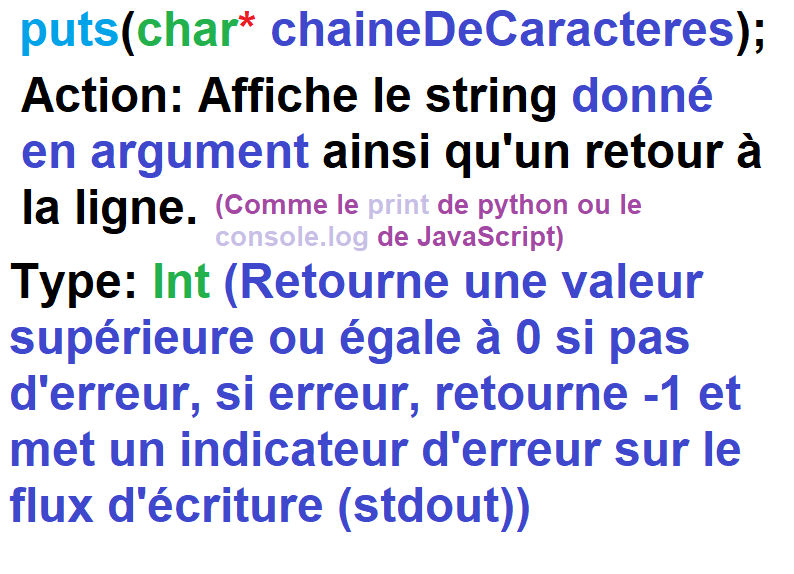
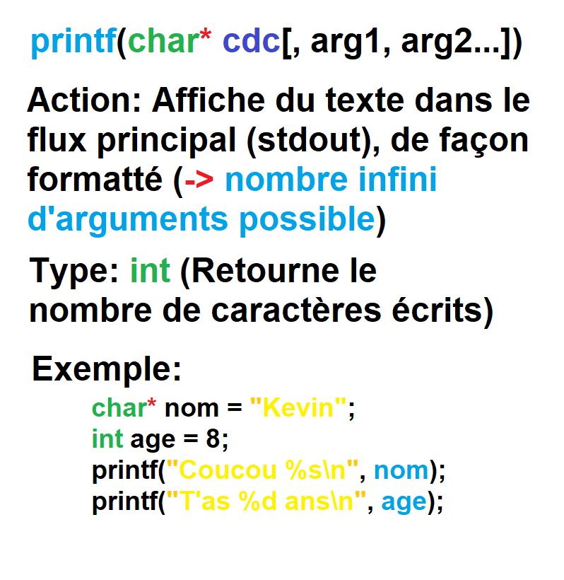
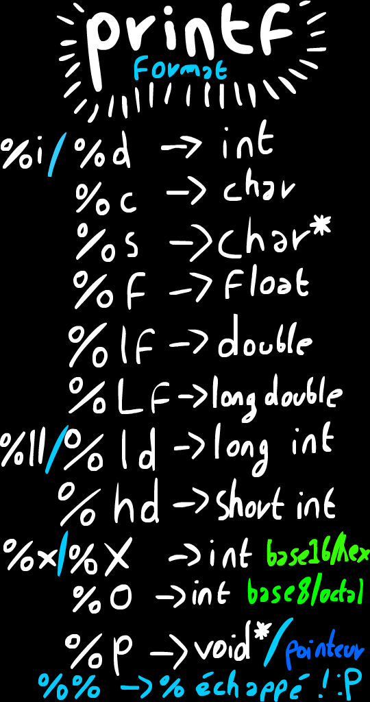
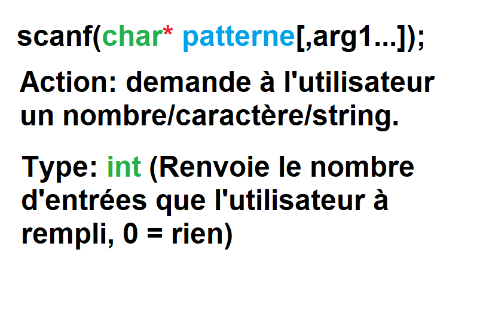
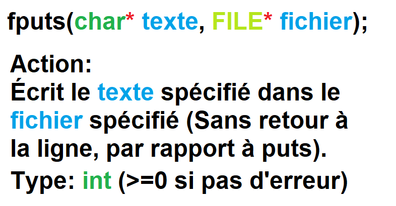
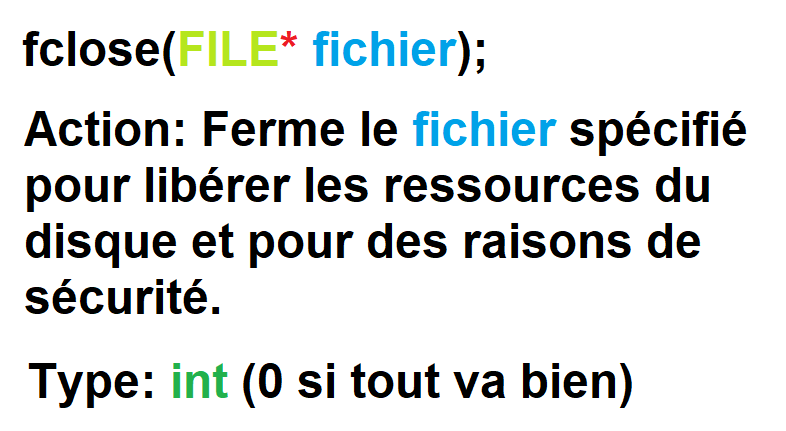

# Préambule

Bienvenue sur ce chapitre Nº2 du C en Fran-C !  
On va parler des entrées/sorties (D'où le nom "frontière")  
Et nous allons enfin afficher du texte !  
...Mais avant ça il va falloir parler de notre ami le compilateur !  

# Erreurs de Compilation

Il va (très (très (très (recursion)))) souvent arriver que votre code ne marche pas du premier coup.  
Il faut veiller aux erreurs de compilation qui pourront vous indiquer des erreurs bêtes (Confondre = et ==) ou invisibles.  
Le compilateur a beaucoup de patience, comme dit plus tôt, il en a vu d'autres :P  
  
Bref, voilà le petit guide pour résoudre les erreurs de compilation:  
1) Vérifier son code, en particulier les lignes indiqués par le compilateur, histoire de résoudre des `;` et `}` manquants  
2) Si vous parlez anglais (Vous le devriez, c'est utile :P) essayez de voir l'erreur, ou au pire, traduisez en ligne  
3) Cherchez sur google en collant une partie de l'erreur, 99,99% de chance de trouver un lien sur le Saint-Forum, stackoverflow.com 

Et pour les erreurs d'exécution, c'est soit le débogueur (On verra plus tard), soit mettre des printf\* partout.  
\*printf: Vous allez bientôt voir :P  

C'est tout pour les erreurs de compilation, mais retenez-le, ça va vous servir ! :)  

# Entrée/Sortie Basique

Pour afficher du texte à l'écran, on a le choix:  
-Utiliser une bibliothèque déjà écrite (Simple et courant)  
-Utiliser les syscalls (Moyen)  
-Utiliser l'assembleur (Dur)  
-Déréférencer les addresses mémoires de la carte vidéo/du VGA pour afficher des caractères à l'écran (Très dur)  
Pour des raisons de simplicité, on va utiliser seulement les deux premières manières, pour la dernière c'est plus pour l'OSDEV  

## Pratique

### Un gentil caractère

Ce qu'il faut comprendre c'est qu'on écrit caractère par caractère.  
Si je vous dis ça c'est pour que vous compreniez un truc:  
Vous vous souvenez quand je vous ai appris à déclarer un string avec la manière array ?  
Rappel:  
```c
char nom[4] = {'L', 'e', 'o', '\0'};
```  
On rajoutait toujours ce fameux `'\0'`, qui signifie l'élément Nº0 de la table ASCII, c'est à dire le null terminator  
Vous allez bientôt comprendre son utilité ;)  
  
Pour commencer, on va utiliser la bibliothèque io, qui permet de faire des entrées sorties de bas niveau  
Dans votre main.c, mettez:  
```c
#include <io.h>

int main(void)
{
  //Coucou !
  return 0;
}
```  
Maintenant, on va afficher un caractère tout seul pour commencer:  
```c
#include <io.h>

int main(void) //Pas besoin d'arguments
{
  char lettreAmaj = 'A';
  write(1,&lettreAmaj,sizeof(char)); //On peut remplacer sizeof(char) par 1 ;)
  return 0;
}
```  

Explications:
La variable lettreAmaj contient `'A'` (Ou 65 en ASCII)  
La fonction write prends 3 arguments: Où écrire (Le flux), un pointeur vers la valeur à écrire, la taille en octets de cette valeur  
Ici, on a écrit vers... 1 ? Qui correpond à stdout -> standard output -> sortie standard (En anglais), universellement  
Bref, si on compile et exécute tout ça, on devrait voir le caractère `A` !  
\**Attention aux utilisateurs de systèmes types UNIX (Mac OS X/GNU+Linux/\*BSD), pas de retour automatique à la ligne, le A risque d'être à gauche de la prochaine ligne*  
  
### Une chaîne de caractère/String

Pareil, mais avec une boucle !  
```c
#include <io.h>

int main(void)
{
  char nom[5] = {'L', 'e', 'o', '!', '\0'};
  int i = 0;
  while(nom[i] != 0)
  {
    write(1, &nom[i++], sizeof(char)); //On utilise i++ pour ne pas incrémenter juste après
  }
  return 0;
}
```  
Les petits malins savent qu'avec un char* on peut utiliser le tableau comme un pointeur et faire plus simple:  
```c
#include <io.h>

int main(void)
{
  char* nom = "Tom!";
  while(nom != 0)
  {
    write(1, nom++, sizeof(char)); //nom est déjà un pointeur, pas besoin de faire &nom++
    //nom++ incrémente déjà
  }
  return 0;
}
```  
Bref, maintenant que vous savez tout ça, on va passer à stdio !  

# Texte avec stdio

Une bibliothèque qui vous servira toute votre vie :D  
stdio -> standard input/ouput -> entrée/sortie standard  
C'est une bibliothèque qui contient plein de fonctions très utiles, dont la première qu'on va utiliser:  
  
Exemple d'utilisation:  
```c
#include <stdio.h> //Ne pas oublier la sainte-bibliothèque

int main(void)
{
  char* message = "Vous allez bien ?";
  puts("Coucou tout le monde !");
  puts(message);
  return 0;
}
```  

## Affichages Formattés

Comment passer à-coté de **printf** ?  
printf -> print formatted -> imprimer formatté/avec format  
Vous allez comprendre avec un petit exemple:  
```c
#include <stdio.h>

int main(void)
{
  int a = 349;
  printf("a vaut %d\n", a);
  return 0;
}
```  
\*Pour information: `\n` compte pour un seul caractère: un retour à la ligne.  
Bref, ce programme affichera `a vaut 349` et un retour à la ligne  
C'est super n'est-ce pas ?  
Voilà une petite description de printf:  
  
Ainsi qu'une aide pour le formattage du texte:  
  
Elle n'est pas complète, on peut aussi citer `%u` pour les nombres unsigned/sans signes/positifs par exemple...  

## Et le clavier ?

Oui, enfin, l'utilisateur va nous parler !  
Dans entrée/sortie, on a vu la sortie, maintenant l'entrée !  
Grâce à `scanf` !  
Et oui, on retrouve encore ce fameux f, ce qui veux dire formata-  

### Un nombre ça serait pas mal

```c
#include <stdio.h>

int main(void)
{
  int age = 0; //Variable utile
  printf("Entrez votre age s'il vous plait: "); //printf pour éviter le retour à la ligne ;)
  scanf("%u", &age); //u -> nombre non signé, évitons l'âge négatif :P
  //On utilise l'adresse mémoire de age et non age, pour qu'il puisse être modifié ;) | Non nécéssaire pour les char*
  //L'utilisateur, en appuyant sur entrée, à déjà fait un retour à la ligne :P
  printf("Vous avez %u ans !\n", age);
  return 0;
}
```  
Vous devriez comprendre en lisant mes commentaires :)  
Bref, on peut demander un char (`%c`), un string/char\* (`%s`), un nombre à virgule float (`%f`), etc...  

### Juste un chiffre !

On va utiliser une propriétée interessante de scanf: la possibilité de limiter la taille de ce que l'utilisateur entre !  
```c
#include <stdio.h>

int main(void)
{
  int chiffre = 2;
  int carres[9] = {1, 4, 9, 16, 25, 36, 49, 64, 81};
  do
  {
    printf("Entrez un chiffre entre 1 et 9 inclus: ");
    scanf("%1d", &chiffre); //Si l'utilisateur entre 349 (Par ex.), chiffre vaudra 3 !
  }while(chiffre < 1 || chiffre > 9); //Si l'utilisateur ne rentre rien, chiffre vaudra 0
  
  printf("%d est la racine carré de %d !\n", chiffre, carres[chiffre-1]); //Car les tableaux commencent à 0 :)
  return 0;
}
```  

### Un string ?

La solution bête serait:  
```c
#include <stdio.h>

int main(void)
{
  char prenom[32];
  printf("Entrez votre prenom: ");
  scanf("%s", prenom); //Un tableau est un pointeur :P
  printf("Bonjour, %s\n", prenom);
  return 0;
}
```  
Pauvre fou ! Vous voulez vraiment avoir un...
...***Buffer Overflow*** ? *Musique Dramatique*  
(Buffer Overflow -> Dépassement de Tampon)  
Pour faire simple, quelqu'un pourrait mettre plus de 32 caractères, et faire planter le programme !  
Ou pire, exécuter du code arbitraire, et, qui sait, élever ses privilèges !  
Bref, voilà la bonne manière:  
```c
#include <stdio.h>

int main(void)
{
  char prenom[32];
  printf("Entrez votre prenom: ");
  scanf("%31s", prenom); //Tableau->Pointeur | 1 de plus, 1 de moins (Au cas où pour le Null Terminator)
  printf("Bonjour, %s\n", prenom);
  return 0;
}
```  

### Tout mélanger

```c
#include <stdio.h>

int main(void)
{
  char lettreCase = 'Z';
  int nombreCase = 0;
  int retour = 0;
  puts("Bienvenue sur plateau d'echec simulator 2021 !");
  do
  {
    printf("Entrez une case: ");
    retour = scanf("%c%d", &lettreCase, &nombreCase); //scanf renvoie le nombre de valeurs entrées, ici on en attend deux !
  } while(retour != 2 || lettreCase < 'A' || lettreCase > 'H' || nombreCase < 1 || nombreCase > 8);
  printf("Je teleporte mon roi et son katana laser en %c%d, echec et mat !\n", lettreCase, nombreCase);
  return 0;
}
```  
Et voilà une petite description de la fonction:  
  

# Lecture et écriture sur le disque avec stdio

Cette fois on va éviter de faire en bare metal avec IO.h même si c'est possible :)  
On va utiliser toutes les commandes qui commencent par f (fopen, fwrite, fprintf, fscanf, fgetc, fgets, fclose...)  

## Ouvrir un fichier

C'est plus dur que ça en à l'air: Il faut faire un choix  
Lire ? (Ré)Écrire ? Rajouter ? Fichier normal ou Binaire ? Plusieurs modes ?  
Alors on va faire les bases:  
r -> read -> lire  
w -> write -> écrire  
a -> append -> rajouter  
b -> binary -> binaire  
\+ -> plus ?  
  
Si on ouvre le fichier en mode r, on peut seulement le lire.  
Si on ouvre le fichier en mode w, il sera vidé si il existe, et on peut seulement écrire.  
Si on ouvre le fichier en mode a, il sera crée si il n'existe pas, et on peut seulement écrire depuis la "fin".  
Si on ouvre le fichier en mode r+, on peut lire et écrire.  
Si on ouvre le fichier en mode w+, il sera vidé si il existe, et on peut lire et écrire.  
Si on ouvre le fichier en mode a+, il sera crée si il n'existe pas, on peut lire le fichier mais l'écriture n'est que depuis la "fin".  
Si on ouvre le fichier en mode rb, on lit des octets (des bits par 8, du binaire en gros) et pas du texte.  
Si on ouvre le fichier en mode wb, il sera vidé si il existe, et on écrit des octets (des bits par 8, du binaire en gros) et pas du texte.  
Si on ouvre le fichier en mode ab, il sera crée si il n'existe pas, et on écrit des octets (des bits par 8, du binaire en gros) et pas du texte, depuis la "fin".  
Si on ouvre le fichier en mode rb+, c'est comme r+ mais version binaire/rb (flemme).  
Si on ouvre le fichier en mode wb+, c'est comme w+ mais version binaire/wb (flemme).  
Si on ouvre le fichier en mode ab+, c'est comme a+ mais version binaire/ab (flemme).  
  
### Pratique

```c
#include <stdio.h>

int main(void)
{
  FILE* fichier = 0; //On met la valeur de fichier à 0
  fichier = fopen("./test.txt", "a"); //Si le fichier n'arrive pas à s'ouvrir, fichier aura comme valeur NULL/0, donc il n'aura pas changé de valeur
  if(fichier == 0) //Si il n'a pas changé de valeur, c'est qu'il y a une erreur
  {
    puts("Erreur pendant l'ouverture du fichier :(");
    return 1;
  }
  else //Sinon on essaye d'écrire dans le fichier
  {
    int writeTest = fputs("Bonjour !\n", fichier); //fputs, lui, n'ajoute pas de nouvelle ligne automatiquement :(
    if(writeTest < 0) //puts et fputs retournent une valeur >= 0 si tout va bien
    {
      puts("Erreur pendant l'écriture dans le fichier :(");
      return 1;
    }
    else
    {
      puts("Regardez le contenu de test.txt :)");
      writeTest = fclose(fichier); //Fermer le fichier
      if(writeTest != 0)
        puts("Erreur pendant la fermeture du fichier :(");
      return 0;
    }
  }
}
```  
Pensez à regarder mes commentaires :)  
  
  
  

#### FILE* ?

On le verra plus tard, il existe **struct** un mot magique qui permet d'aller plus proche vers la programmation objet :)  
Bref, stdio.h à crée le type FILE* (Et donc FILE) qui permet d'identifier un fichier.  

#### ./test.txt

./truc = Le fichier truc **dans le dossier d'exécution**  
Avec certaines commandes il est possible d'utiliser le dossier ou se trouve le programme, je vous expliquerai la différence plus tard :)  

Suite pour après.
